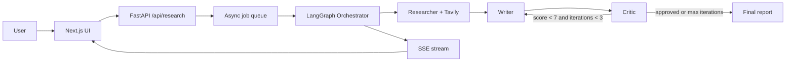

# Multi-Agent Research System

> A production-grade AI research pipeline where three specialized agents — Researcher, Writer, and Critic — collaborate autonomously to produce comprehensive research reports.

**[Live Demo](your-vercel-url)** · **[Video Walkthrough](your-loom-url)**

## How It Works

The backend is a FastAPI service built around a LangGraph `StateGraph`. A shared `AgentState` moves through three specialized Claude-powered agents: the Researcher searches the web through Tavily, the Writer turns findings into a structured markdown report, and the Critic evaluates the report for accuracy, completeness, clarity, structure, and source quality.

The core quality loop is Writer → Critic → Writer. The Critic returns a structured score from 1 to 10 and an `approved` boolean. If the score is below the threshold, LangGraph routes the state back to the Writer with the Critic's issues and suggestions. The loop is capped at three iterations to avoid runaway work while still producing the best available draft.

Every agent emits lifecycle events into a per-job async queue. FastAPI serves those events over Server-Sent Events, and the Next.js frontend consumes them with `EventSource`, stores them in Zustand, and updates the agent trace cards in real time as the pipeline runs.

## Architecture Diagram



## Tech Stack

| Layer | Technology | Why |
| --- | --- | --- |
| Agent Framework | LangGraph | Explicit state machine with conditional cycles |
| LLM | Claude 3.5 Haiku | Fast structured reasoning for agent tasks |
| Search | Tavily | Search API designed for AI research workflows |
| Backend | FastAPI + SSE | Simple async API with native streaming |
| State | Redis | Production-ready job health and persistence target |
| Frontend | Next.js 15 + Zustand | Typed React UI with lightweight client state |
| Deploy | Railway + Vercel | Dockerized backend and optimized frontend hosting |

## Local Setup

1. Copy environment files:

```bash
cp backend/.env.example backend/.env
cp frontend/.env.local.example frontend/.env.local
```

2. Add your keys to `backend/.env`:

```bash
ANTHROPIC_API_KEY=sk-ant-...
TAVILY_API_KEY=tvly-...
REDIS_URL=redis://localhost:6379
ALLOWED_ORIGINS=http://localhost:3000
```

3. Start Redis:

```bash
docker run -d --name redis-agent -p 6379:6379 redis:7-alpine
```

4. Install and run the backend:

```bash
cd backend
pip install -r requirements.txt
python -m uvicorn main:app --reload --port 8000
```

5. Install and run the frontend:

```bash
cd frontend
npm install
npm run dev
```

6. Open `http://localhost:3000`, enter a research query, and watch the agents stream progress.

## Key Engineering Decisions

- LangGraph keeps orchestration explicit and makes the Writer → Critic revision cycle easy to reason about.
- SSE is simpler than WebSockets for one-way agent progress streaming.
- Pydantic structured outputs remove fragile text parsing between agents.
- The revision cap prevents infinite loops while preserving quality feedback.
- A per-job async queue keeps concurrent streams isolated by `job_id`.

## Your Resume Bullet Point

**Multi-Agent AI Research System** | LangGraph · Claude API · FastAPI · Next.js · Redis  
*[Live URL] · [GitHub URL]*

- Architected a 3-agent pipeline (Researcher, Writer, Critic) using LangGraph's StateGraph with conditional revision loops — Critic scores drafts 1–10 and routes back to Writer until quality threshold is met
- Built real-time SSE streaming from FastAPI to Next.js so users watch each agent's reasoning live, token by token
- Implemented structured Pydantic outputs for all agent responses enabling reliable Orchestrator routing with zero parsing failures
- Deployed on Railway (Docker + Redis) + Vercel; handles concurrent research jobs via asyncio with Redis-backed job state persistence

## Interview Talking Points

**"What was the hardest technical challenge?"**

"The revision loop. I needed the Critic's approval decision to conditionally route back to the Writer in LangGraph. I used `add_conditional_edges` with a routing function that reads the critique's `approved` boolean and `iteration_count` from shared state. I also had to cap it at 3 iterations to prevent infinite loops while still finalizing with the best available draft."

**"Why LangGraph instead of just writing a for loop?"**

"LangGraph gives me persistent state across node transitions, built-in support for cycles (the Writer→Critic→Writer loop), and the ability to introspect the graph visually. A plain loop would lose state context between agents and couldn't easily support future features like human-in-the-loop checkpoints."

**"How does the streaming work?"**

"Each agent awaits an `emit_fn` callback to push events to a per-job asyncio Queue. The FastAPI endpoint serves that queue as an SSE stream. The frontend uses a native EventSource to receive those events and update a Zustand store, which re-renders the agent cards in real time. No WebSockets needed — SSE is simpler and perfectly suited for server-to-client one-way streaming."
